## Lesson 2: Step by step guide

### Event Registration

- User goes to the developer console to setup events registration using this user action. User created a project on dev console as below
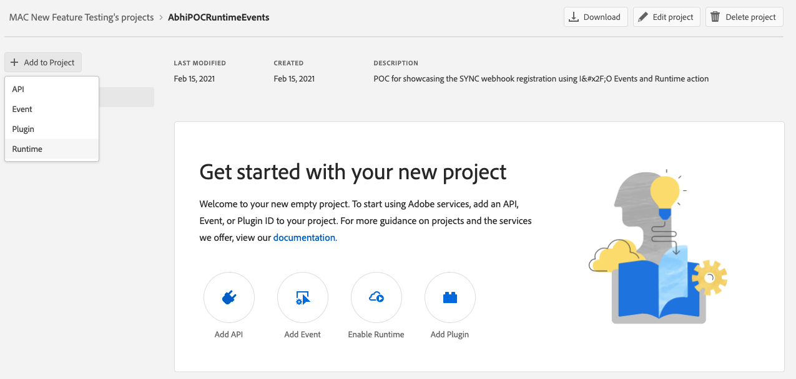

- Add Runtime to your project. This will create the namespace for you
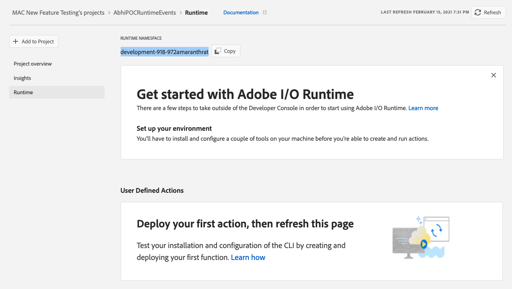

- Now, go to aio-cli and login to your namespace using aio login
Once you have the aio-cli setup with your namespace and running, go to the terminal and run the below. This will show none of the runtime entities present yet
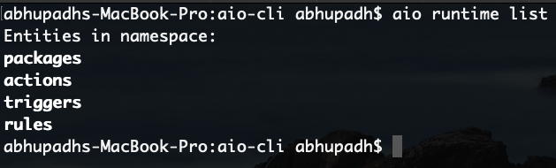

- The user will create and deploy his business logic runtime action using the below command
```bash
aio runtime:action:create abhi_test_user_action /path_to_user_action_js_file/abhi_test_user_action.js
``` 
-  See the entity list again and you will see the user action created in the user namespace
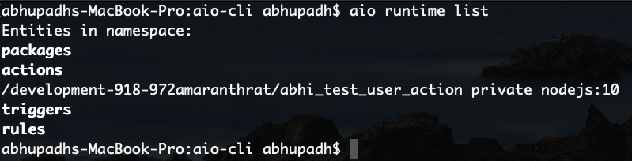

-  User now sees this runtime action created in the user defined actions
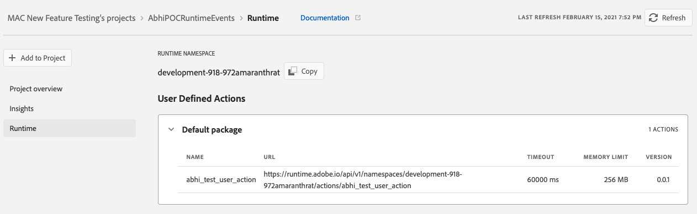

- User now adds the event api to the project to setup the event registration
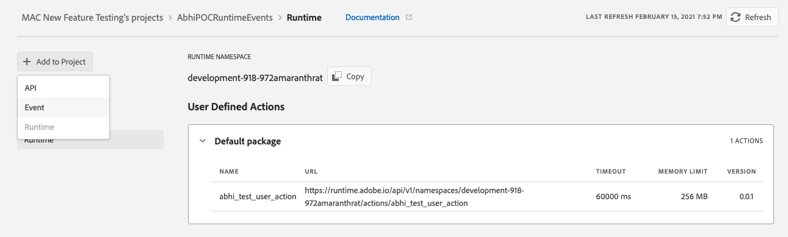

- Adding from the Experience Cloud events provider - aep_observability_catalog_events
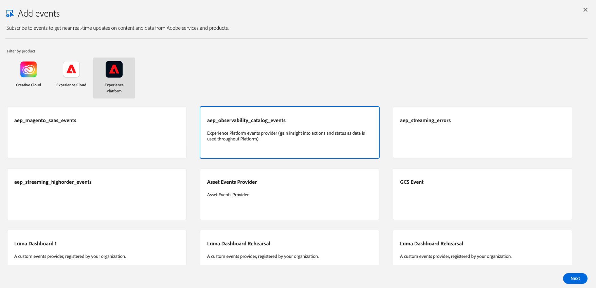

- Subscribing to the "data ingestion notification" event type
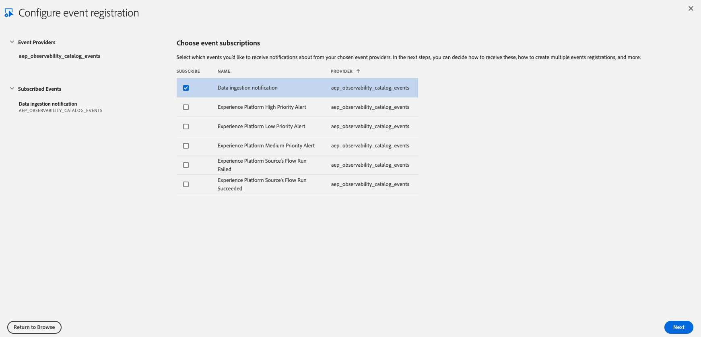

- Generate the JWT service account credentials key pair
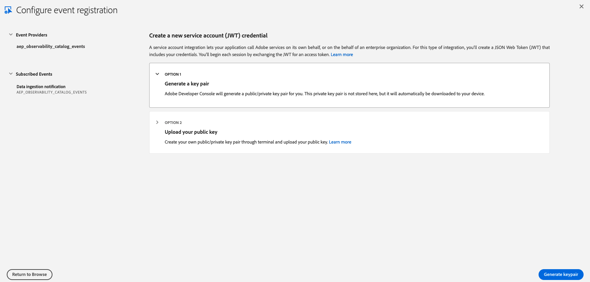

- On the registration details page provide name and select the runtime user action created to setup event registration
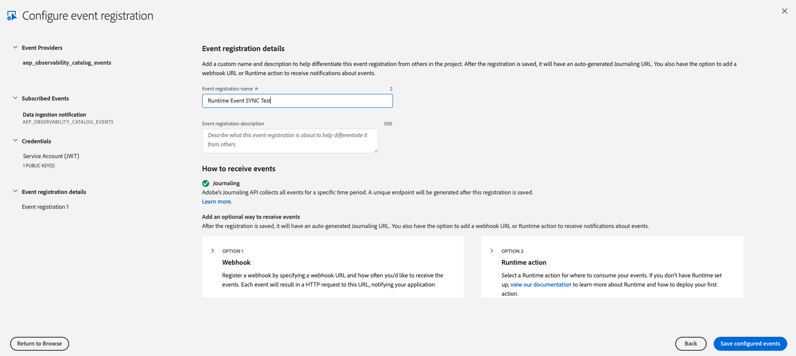

- Select the user action from the dropdown of Runtime Actions 
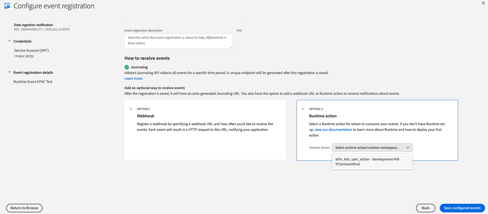

-  Now, if we go to dev console we see this new "SYNC Event Registration" - with new sync event handler as webhook registered successfully
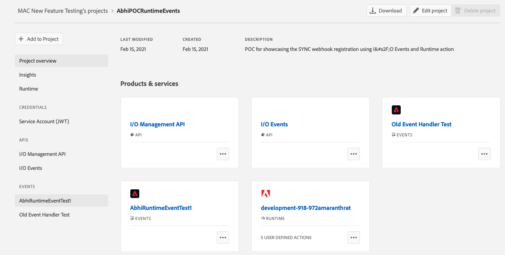


Next lesson: [Verify the result](lesson3.md)