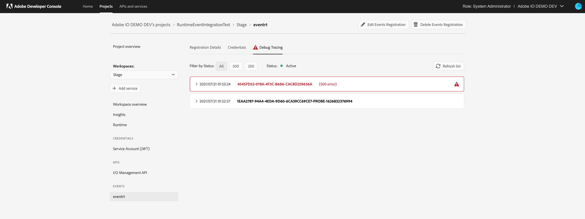
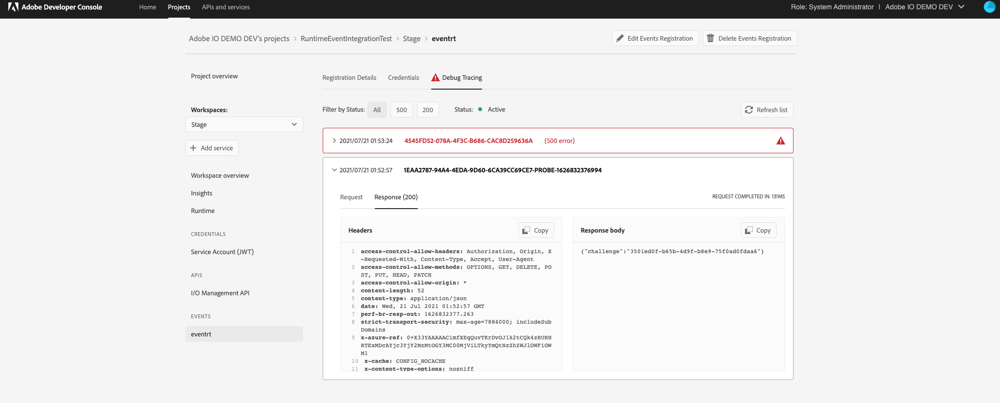
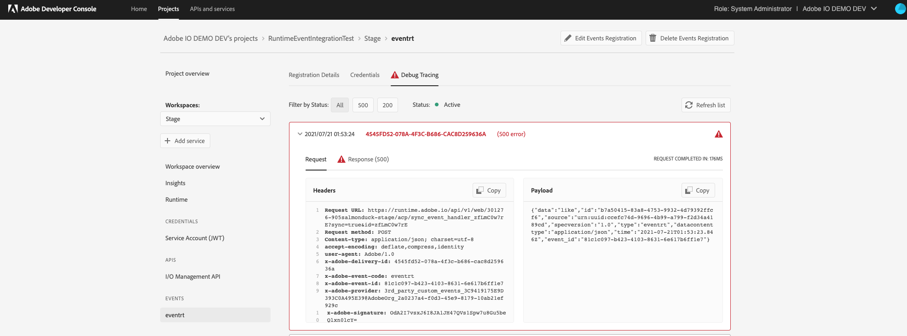
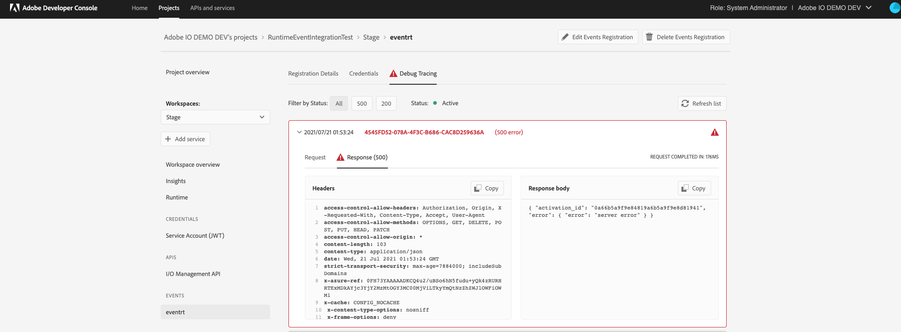

## Lesson 2: Verify the result

### Deep dive in
Now let's take a deeper look into these actions:
- `bound_package` : default param package created as binding of the shared package deployed in adobe namespace and having the validate action inside itself. Now, this bound_package will also have the validate_action residing in it due to binding.
- `acp` - package created which will keep the new sync_event_handler sequence
- `sync_Event_handler_7Z5KH5vv6X` - the new event handler unique to this registration with webhook url
- `3rd_party_custom_events_3C9419175E9D393C0A495E39@AdobeOrg_2a0237a4-f0d3-45e9-8179-10ab21ef929c_eventrt_7Z5KH5vv6X` - the user sequence created taking the validate action as first action and user runtime action as second action. Created with the same unique identifier suffixed at the end of its name to bind this user sequence with the event registration in 1:1 fashion.
-  `publish-events` - the user business logic runtime action


### Verfiy the result
Now, we will ingest some events to see how this new SYNC webhook behaves, send through `publish-event` or using postman 
after ingesting the event, this is the request to the sync webhook, I made one successful one and another failed one to show the debug tracking feature


 Now we can see json response returned from the main event handler webhook in the debug tracing



The debug tracing response in case of user action code failure. Note that, now the json response includes the activation id of the failed user_sequence (using which user can trace it down to his action code failure) along with the exact user code failure message.



Debug tracing is a pretty important tool on Developer Console for users who want to be informed whether their runtime action invocation is successful or not or what it responds. However, in case of any failed invocation to your webhook, you will get an error response body with an activation id for the same. This helps users to debug their actions as below

This activation id you can use in the `aio cli` to trace the actual error occurred in your invocation by doing 
```
aio rt activation logs <failed_activation_id>
```
You may now get activation ids for two types of failed activations:

- Signature Validator Action
- Your Runtime Action

In case of failure in the signature verification step, this is how you will get the error response and the failed activation id for the same.


Next lesson: [Well done](welldone.md)
