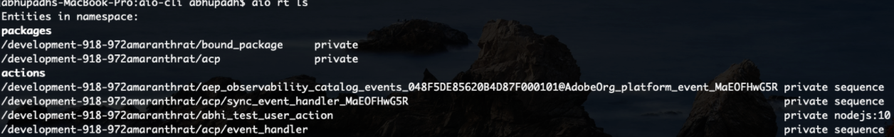
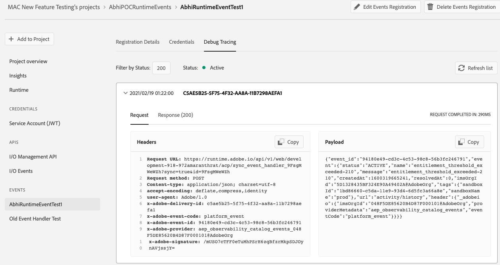
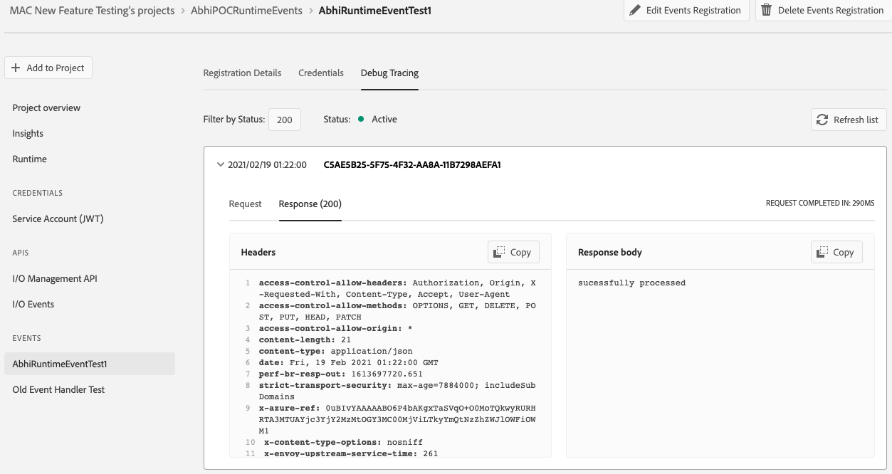
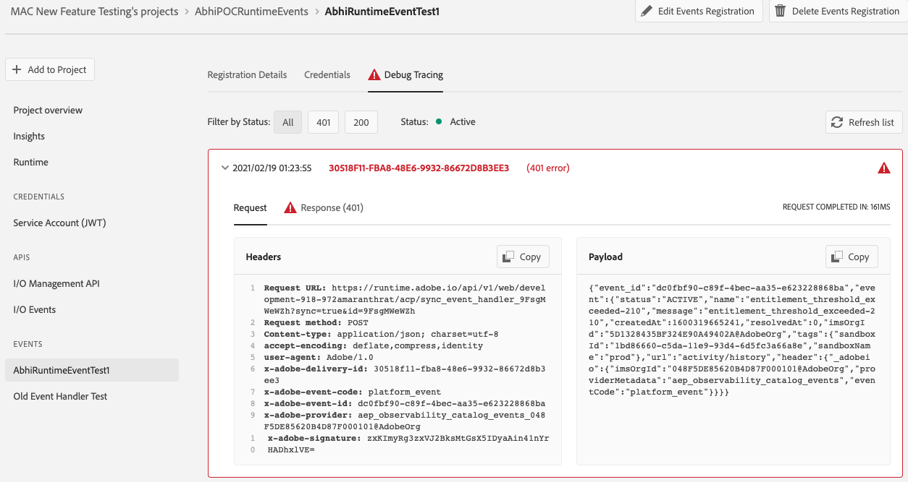
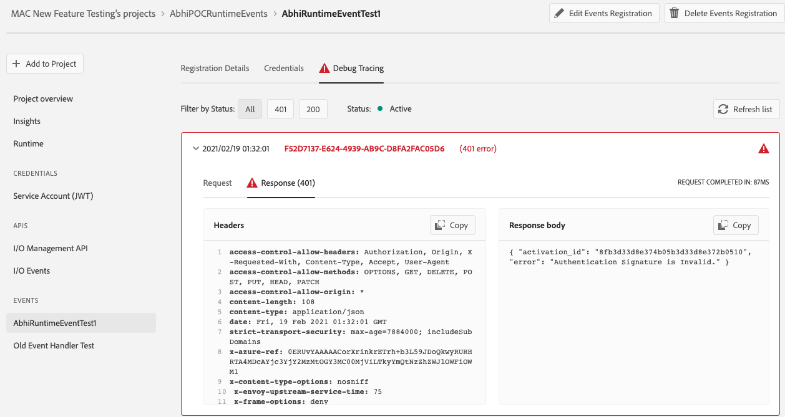
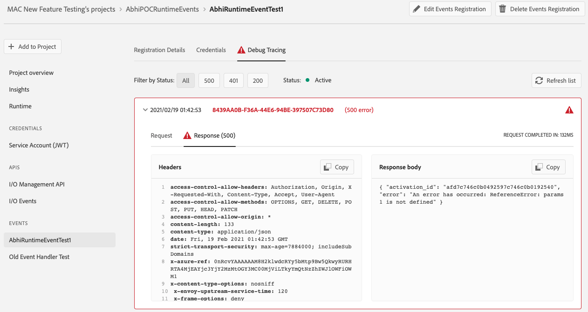

## Lesson 3: Verify the result

### Deep dive in
Now, if user goes to his aio-cli and do "aio runtime list", he can see the below entities created as part of the new flow of event registration

Now let's take a deeper look into these actions:
- bound_package : default param package created as binding of the shared package deployed in adobe namespace and having the validate action inside itself. Now, this bound_package will also have the validate_action residing in it due to binding.
- acp - package created which will keep the new sync_event_handler sequence
- sync_Event_handler_MaEOFHwG5R - the new event handler unique to this registration with webhook url
- aep_observability_catalog_events_048F5DE85620B4D87F000101@AdobeOrg_platform_event_MaEOFHwG5R - the user sequence created taking the validate action as first action and user runtime action as second action. Created with the same unique identifier suffixed at the end of its name to bind this user sequence with the event registration in 1:1 fashion.
-  /acp/event_handler - the old event handler created as part of the event registration done via console

- abhi_test_user_action - the user business logic runtime action

### Verfiy the result
Now, we will ingest some events of type aep_observability_catalog  to see how this new SYNC webhook behaves
After ingesting the event, this is the request to the sync webhook

 Now we can see json response returned from the main event handler webhook in the debug tracing

Lets see the request-response in case of when signature verification fails. Thing to note is the activationId returned from the validator action (the 1st action in your user sequence)

The debug tracing response in case of user action code failure. Note that, now the json response includes the activation id of the failed user_sequence (using which user can trace it down to his action code failure) along with the exact user code failure message.

Next lesson: [Well done](welldone.md)